# Per-FI relational data model — ERD

The target entities each FI tenant's raw data resolves into, supporting **audience rules**
(quantifier + same-instance conditions), **synced/predictive segments**, and **campaign
personalization** (tokens from the enrolling instance). Grounded in the real Symitar VIP
extract analysis (`SYMITAR-FINDINGS.md`), the prototype's multi-entity registry, and the
competitive research (Salesforce FSC's FinancialAccount/Role/Household pattern, CuneXus offer
lifecycle, Segment-style identity resolution, Digital Onboarding eligibility-on-catalog).

Conventions: every entity is tenant-scoped by `fi_id` (drawn only where it aids reading);
**vocabulary is FI-mapped** (codes → labels), **semantics are Pulsate-curated**
(`REGISTRY_FIELD`); no payment or revenue entities exist — only facts Pulsate observes.

```mermaid
erDiagram
  %% ───────── Tenancy & ingestion ─────────
  FI ||--o{ SOURCE : connects
  FI ||--o{ MEMBER : serves
  FI ||--o{ PRODUCT_CODE : "maps codes"
  FI ||--o{ OFFER_TYPE : "maps offer types"
  FI ||--o{ AUDIENCE : owns
  FI ||--o{ FLOW : owns
  SOURCE ||--o{ SYNC_RUN : runs
  SOURCE ||--o{ FIELD_MAPPING : declares
  SOURCE ||--o{ IDENTITY_LINK : supplies

  %% ───────── Identity & parties ─────────
  MEMBER ||--o{ IDENTITY_LINK : "known as"
  HOUSEHOLD ||--o{ HOUSEHOLD_MEMBER : groups
  MEMBER ||--o{ HOUSEHOLD_MEMBER : "belongs via"
  MEMBER ||--o{ CONSENT : grants

  %% ───────── Registry & vocabulary ─────────
  PRODUCT_CATEGORY ||--o{ PRODUCT_CODE : classifies
  PRODUCT_CATEGORY ||--o{ REGISTRY_FIELD : "defines fields for"
  REGISTRY_FIELD ||--o{ FIELD_MAPPING : "is target of"

  %% ───────── Instance data ─────────
  MEMBER ||--o{ PRODUCT_RECORD : holds
  PRODUCT_CODE ||--o{ PRODUCT_RECORD : types
  PRODUCT_RECORD ||--o{ PRODUCT_RECORD_VALUE : has
  REGISTRY_FIELD ||--o{ PRODUCT_RECORD_VALUE : defines
  PRODUCT_RECORD ||--o{ RECORD_CHANGE : "changes tracked"
  SYNC_RUN ||--o{ RECORD_CHANGE : detects
  MEMBER ||--o{ OFFER : "qualifies for"
  OFFER_TYPE ||--o{ OFFER : types
  MEMBER ||--o{ MEMBER_ELIGIBILITY : "eligible for"
  PRODUCT_CODE ||--o{ MEMBER_ELIGIBILITY : "subject of"
  MEMBER ||--o{ MEMBER_ATTRIBUTE_VALUE : "described by"
  REGISTRY_FIELD ||--o{ MEMBER_ATTRIBUTE_VALUE : defines
  MEMBER ||--o{ SCORE : scored
  MEMBER ||--o{ EVENT : performs

  %% ───────── Activation ─────────
  AUDIENCE ||--o{ FLOW : "entry audience of"
  FLOW ||--o{ FLOW_STEP : contains
  FLOW ||--o{ ENROLLMENT : enrolls
  MEMBER ||--o{ ENROLLMENT : "enrolled in"
  PRODUCT_RECORD |o--o{ ENROLLMENT : "may anchor"
  OFFER |o--o{ ENROLLMENT : "may anchor"
  ENROLLMENT ||--o{ MESSAGE_EVENT : receives
  FLOW_STEP ||--o{ MESSAGE_EVENT : sends

  FI {
    uuid id PK
    string name
    string core_type "symitar | fiserv | keystone | other"
    json settings
  }
  SOURCE {
    uuid id PK
    uuid fi_id FK
    string type "core | crm | insights | sdk | file"
    string entity_targets "products, attributes, offers, events"
    json config "cadence, credentials ref"
  }
  SYNC_RUN {
    uuid id PK
    uuid source_id FK
    datetime started_at
    string status "ok | partial | failed"
    int rows
    json errors "row-level failures"
  }
  FIELD_MAPPING {
    uuid id PK
    uuid source_id FK
    string raw_column "e.g. AUTO_LN1_DUE_DT"
    uuid registry_field_id FK
    string transform "coercion, sentinel decode"
  }
  MEMBER {
    uuid id PK
    uuid fi_id FK
    string member_number UK "canonical key from core"
    string status
    date created_at
  }
  IDENTITY_LINK {
    uuid id PK
    uuid member_id FK
    uuid source_id FK
    string external_id "hashed acct no, email, device id"
    string method "member_number | email | device"
    float confidence
    string status "resolved | unresolved"
  }
  HOUSEHOLD {
    uuid id PK
    uuid fi_id FK
  }
  HOUSEHOLD_MEMBER {
    uuid household_id FK
    uuid member_id FK
    string role "primary | joint | beneficiary"
  }
  CONSENT {
    uuid member_id FK
    string channel "push | inapp | feed"
    string status "granted | revoked"
    datetime updated_at
  }
  PRODUCT_CATEGORY {
    string key PK "loan | deposit | certificate | card"
    string label "Pulsate-curated, versioned"
  }
  REGISTRY_FIELD {
    uuid id PK
    string entity_class "product | offer | member_attribute"
    string category_key FK "when entity_class = product"
    string key "dueDate, balance, amount"
    string label "display name - FI-overridable"
    string type "currency | number | date | string | bool"
    string semantic_role "recurring_date | terminal_date | balance"
  }
  PRODUCT_CODE {
    uuid id PK
    uuid fi_id FK
    string code "0010, LN03 - per-FI vocabulary"
    string label "Auto Loan - FI display name"
    string category_key FK
    uuid source_id FK
  }
  OFFER_TYPE {
    uuid id PK
    uuid fi_id FK
    string code "CNX-AUTO - vendor vocabulary"
    string label "Auto loan pre-approval"
    uuid source_id FK
  }
  PRODUCT_RECORD {
    uuid id PK
    uuid member_id FK
    uuid product_code_id FK
    string external_key UK "acct no + share or loan ID"
    string status "open | closed | charged_off"
    date opened_at
    date closed_at
  }
  PRODUCT_RECORD_VALUE {
    uuid record_id FK
    uuid registry_field_id FK
    string value "typed; null = not set after sentinel decode"
    datetime as_of
  }
  RECORD_CHANGE {
    uuid id PK
    uuid record_id FK
    uuid registry_field_id FK
    uuid sync_run_id FK
    string old_value
    string new_value
    datetime detected_at
  }
  OFFER {
    uuid id PK
    uuid member_id FK
    uuid offer_type_id FK
    decimal amount
    decimal rate
    date expires_at
    string status "active | accepted | expired | withdrawn"
    string provenance "prescreen-FCRA | internal | vendor"
  }
  MEMBER_ELIGIBILITY {
    uuid member_id FK
    uuid product_code_id FK
    bool eligible
    uuid source_id FK
    datetime computed_at
  }
  MEMBER_ATTRIBUTE_VALUE {
    uuid member_id FK
    uuid registry_field_id FK
    string value
    uuid source_id FK "core, CRM, file"
    datetime updated_at
  }
  SCORE {
    uuid member_id FK
    string model "loan_propensity | churn_risk"
    float value
    datetime computed_at
  }
  EVENT {
    uuid id PK
    uuid member_id FK
    string name "app_open, screen_view, click"
    json props
    datetime occurred_at
  }
  AUDIENCE {
    uuid id PK
    uuid fi_id FK
    string name
    string kind "rule | synced | predictive"
    json rule "entity, quantifier, scope, conditions"
  }
  FLOW {
    uuid id PK
    uuid fi_id FK
    string name
    string status "draft | live"
    uuid entry_audience_id FK
    json entry_trigger "audience | date_anchor | location | schedule"
    json exit_rules "goal, instance, audience + reenroll policy"
  }
  FLOW_STEP {
    uuid id PK
    uuid flow_id FK
    string type "message | delay | branch"
    json config
  }
  ENROLLMENT {
    uuid id PK
    uuid flow_id FK
    uuid member_id FK
    string instance_type "product_record | offer | none"
    uuid instance_id "polymorphic FK"
    json snapshot "instance values at entry - token source"
    datetime entered_at
    datetime exited_at
    string exit_type "goal | removed | completed"
  }
  MESSAGE_EVENT {
    uuid id PK
    uuid enrollment_id FK
    uuid flow_step_id FK
    string type "delivered | opened | clicked"
    string channel "push | inapp | feed"
    datetime occurred_at
  }
```

## Entity glossary

### Tenancy & ingestion

| Entity | Purpose | Fed by |
|---|---|---|
| `FI` | The tenant. Every entity below is scoped to one FI. | onboarding |
| `SOURCE` | A connected data origin (Symitar core, HubSpot, prequal insights, mobile SDK, uploads). Declares which entity classes it feeds. | admin/setup |
| `SYNC_RUN` | One ingestion run of a source — the feed-health surface (rows, partial failures, row-level errors). | ingestion |
| `FIELD_MAPPING` | Raw column → registry field, with transforms (type coercion, sentinel decoding like `--/--/----` → null). The import wizard's output; for standard extracts, shipped with the spec. | wizard / spec |

### Identity & parties

| Entity | Purpose | Fed by |
|---|---|---|
| `MEMBER` | The canonical person, keyed by the core's member number. Minimal PII by design. | core |
| `IDENTITY_LINK` | Each source's external identifier for a member, with match method and confidence — the identity-resolution surface (e.g. HubSpot email-join at 74%). | all sources |
| `HOUSEHOLD` / `HOUSEHOLD_MEMBER` | Joint owners and beneficiaries (Symitar NAME records: type 00 = primary, 01 = joint). Enables household-level cross-sell later. FSC analog: AccountContactRelation. | core |
| `CONSENT` | Per-channel marketing permission — first-class for examiner-readiness. | app / preference center |

### Registry & vocabulary

| Entity | Purpose | Fed by |
|---|---|---|
| `PRODUCT_CATEGORY` | Pulsate-curated, versioned taxonomy (loan, deposit, certificate, card). The opinionated layer everything binds to. | Pulsate releases |
| `REGISTRY_FIELD` | Typed field definitions per entity class, with semantic roles (recurring date, terminal date, balance). Operators, sentences, anchors, and tokens bind here — labels are display names supplied by mapping, not invented nouns. | Pulsate releases |
| `PRODUCT_CODE` | The FI's own product vocabulary (`0010` → "Auto Loan" → loan). The only modeling a customer does. | catalog UI |
| `OFFER_TYPE` | Vendor offer vocabulary (`CNX-AUTO` → "Auto loan pre-approval"). Same mapping pattern, second entity. | catalog UI |

### Instance data

| Entity | Purpose | Fed by |
|---|---|---|
| `PRODUCT_RECORD` | One held product instance per member — keyed by the **core's stable instance identity** (account + share/loan ID), never column position. Lifecycle states (open/closed/charged-off) make "paid off" a state, not a deletion. | core |
| `PRODUCT_RECORD_VALUE` | Current typed values per registry field; null after sentinel decoding means genuinely not-set (blank-check semantics). | core |
| `RECORD_CHANGE` | Change-data-capture between syncs — the mechanism that turns state snapshots into events: date anchors ("due date rolled forward"), drift signals, sync-derived goals. | ingestion diffing |
| `OFFER` | A qualification instance with its own attributes and lifecycle (active → accepted/expired/withdrawn) and provenance (FCRA obligations for credit-derived prescreens). CuneXus-style perpetual prequalification lands here. | insights feeds |
| `MEMBER_ELIGIBILITY` | Source-fed eligibility facts per member × product code — distinct from materialized offers; powers "eligible but doesn't hold it" acquisition audiences. | insights feeds |
| `MEMBER_ATTRIBUTE_VALUE` | Mapped member-level attributes — where **CRM data** (HubSpot lifecycle stage, relationship manager) and misc feeds land. | CRM, core, files |
| `SCORE` | Model outputs (propensity, churn risk) refreshed on a cadence — powers predictive segments. | ML/vendor |
| `EVENT` | Behavioral events Pulsate observes directly (app opens, screens, clicks). | mobile SDK |

### Activation

| Entity | Purpose | Fed by |
|---|---|---|
| `AUDIENCE` | First-class, reusable; kind = rule (evaluated live), synced, or predictive. The rule JSON is the builder's output (entity, quantifier, scope, same-instance conditions). | audience builder |
| `FLOW` / `FLOW_STEP` | The journey and its steps; entry trigger and exit rules (goal / instance / audience-mismatch + re-enrollment policy) live on the flow. | flow editor |
| `ENROLLMENT` | **The pivotal record**: one membership of one member in one flow, anchored to a polymorphic enrolling instance (product record or offer) with a value **snapshot at entry**. The unit of per-product/per-offer enrollment, of instance-scoped exits, and the token source for personalization. | runtime |
| `MESSAGE_EVENT` | Delivered / opened / clicked per enrollment and step — the only engagement facts the platform may claim. | delivery + SDK |

## Design decisions

1. **Stable instance identity comes from the core.** `PRODUCT_RECORD.external_key` = account + share/loan ID (proven present in the VIP extract). Column-position identity (AUTO_LN1 vs LN2) is explicitly rejected — positions shift when loans close.
2. **`RECORD_CHANGE` is the events-from-snapshots mechanism.** Pulsate never sees payments; it sees fields change between syncs. Everything event-like derived from FI data (date anchors, drift, "due date advanced" goals) routes through CDC and is labeled sync-derived in UI.
3. **`ENROLLMENT` is the unit of everything downstream.** Per-instance enrollment, instance-scoped exits, frequency caps, and personalization tokens all key on the enrollment record and its snapshot — a member with two qualifying loans has two enrollments with independent lifecycles.
4. **Vocabulary is FI-mapped; semantics are Pulsate-curated.** `PRODUCT_CODE`/`OFFER_TYPE` labels belong to the customer; `REGISTRY_FIELD` types, roles, and operators belong to Pulsate. The UI may only speak in mapped labels, observed events, and labeled derived signals.
5. **Values are EAV with typed projections as an optimization detail.** `*_VALUE` tables keep "new category = data, not DDL"; hot fields can be projected into typed columns without changing this logical model.
6. **No payment, transaction, or revenue entities.** Deliberate: transaction-level ingestion is an explicitly open decision with its own cost envelope; nothing in this model pretends otherwise.

## How each surface queries this

| Surface | Query shape |
|---|---|
| Product rule ("any loan where due date in next 3 days") | `MEMBER → PRODUCT_RECORD (via PRODUCT_CODE.category) → PRODUCT_RECORD_VALUE`, conditions per record (same-instance), quantifier over matching records per member |
| Offer rule ("pre-approved > $10k expiring soon") | `MEMBER → OFFER (via OFFER_TYPE)`, same grammar |
| Eligibility campaign ("eligible for HELOC, doesn't hold one") | `MEMBER_ELIGIBILITY ∩ NOT EXISTS PRODUCT_RECORD` for the code — the cross-entity rule that motivates rule-composition v2 |
| Predictive segment | `SCORE` threshold or vendor-synced membership |
| Date anchor ("3 days before [date field]") | scheduler over `PRODUCT_RECORD_VALUE`/`OFFER.expires_at`; recurrence driven by `RECORD_CHANGE` on the anchored field |
| Personalization token (`{{offer.amount}}`) | `ENROLLMENT.snapshot` — values frozen at entry; refresh-at-send reads current `*_VALUE` when the message opts in |
| Send-time re-check | re-evaluate the audience rule for the enrollment's member/instance at send |
| Performance | `ENROLLMENT` (entered / exit_type) × `MESSAGE_EVENT` (delivered/opened/clicked) — goal counts only when the flow defines a goal |

## Research provenance

| Entity / decision | Evidence |
|---|---|
| `PRODUCT_RECORD` + external_key | Symitar VIP.LOAN: one row per loan, Loan ID present; 46% multi-loan accounts (081126 sample) |
| `HOUSEHOLD_MEMBER` roles | VIP.NAME: 279 joint/other records across 178 accounts (Name Type 00/01/…) |
| `IDENTITY_LINK` confidence | Hashed vs non-hash account numbers in the extract; HubSpot email-join reality |
| Sentinel-decoded nulls in `*_VALUE` | 48% `--/--/----` maturity dates in the real file; G-5 blank-check gap analysis |
| `RECORD_CHANGE` | 94% stale due dates in the sample → freshness/recurrence must be change-driven |
| `OFFER` lifecycle + provenance | CuneXus perpetual prequalification model; FCRA firm-offer obligations |
| `MEMBER_ELIGIBILITY` | Digital Onboarding "service eligibility criteria" on product codes |
| `PRODUCT_CATEGORY`/`REGISTRY_FIELD` split | Opinionated-vs-generic analysis; HubSpot/FSC/Klaviyo convergence on curated semantic layers |
| `ENROLLMENT` + exit_type | Enrollment semantics: entry is an event, membership owned by the flow; exits explicit, classified |
| `MESSAGE_EVENT`-only engagement | Honesty rule: no invented payment/revenue facts |
