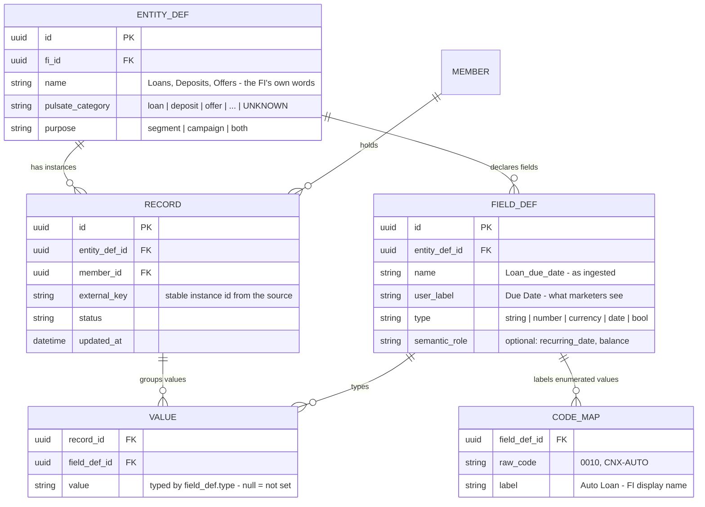

# Per-FI relational ingestion model

Four tables plus one label dictionary. Any relational entity an FI sends — products, offers,
eligibility, or any other member-related metadata — ingests as **rows**, never schema. Every
table is scoped to the FI (`fi_id`) and every instance is related to a member. This is the
complete model needed to build segments on that data and personalize campaigns from it.

## Worked example

Any FI, any vocabulary — here a consumer-credit lineup — with zero schema changes:

| Table | Rows |
|---|---|
| `ENTITY_DEF` | `(1, "Loans", loan, segment/campaign)` |
| `FIELD_DEF` | `(1, Loan_name, "Name", string)` · `(2, Loan_due_date, "Due Date", date)` · `(3, Loan_balance, "Balance", currency)` |
| `RECORD` | `(r1, entity 1, member 7, key L-0001)` — the Flexi Credit loan · `(r2, entity 1, member 7, key L-0002)` — the Emag installment plan |
| `VALUE` | `(r1, f1, "Flexi Credit")` `(r1, f2, 2026-09-01)` `(r1, f3, 4200)` · `(r2, f1, "Emag")` `(r2, f2, 2026-08-20)` `(r2, f3, 1150)` |

Offers are just another `ENTITY_DEF` (fields: amount, rate, expiration); so are eligibility
facts, scores, and any other metadata. Member-level attributes (e.g. CRM fields) are an entity
with one record per member.

## Why each piece is load-bearing

- **`RECORD`** — the one thing a minimal entity→field→value sketch cannot skip. It ties
  "Flexi Credit" and *its* due date and *its* balance together, so "any loan where due date is
  in the next 7 days **and** balance > 0" evaluates per loan, and a member with two qualifying
  loans is targetable per loan. Values keyed by field alone cannot express this.
- **`member_id`** — relates every instance to a person; without it no segment can be built.
- **Typed values, not BLOBs** — `type` on `FIELD_DEF` is what makes date windows, numeric
  comparisons, and is-not-set checks possible; null means genuinely not-set (sentinels like
  `--/--/----` decoded on ingest).
- **`external_key`** — the source's stable instance id (e.g. account + loan ID), so a record
  stays the same record across syncs; never identify by file column position.
- **`pulsate_category = UNKNOWN`** and unlabeled `CODE_MAP` rows — the "needs mapping" queue;
  mapping them is the only modeling a customer ever does.

## How segments and personalization read it

| Use | Query shape |
|---|---|
| Segment on products ("any loan where Due Date in next 7 days and Balance > 0") | members having ≥1 `RECORD` of the entity whose `VALUE`s satisfy all conditions **on the same record**; quantifiers (any / none / 2+) count matching records per member |
| Segment on offers / eligibility / other metadata | identical — only the `ENTITY_DEF` differs |
| Cross-entity ("eligible for X, holds no X") | intersect per-member results across two entity defs |
| Personalized campaign (`{{loan.due_date}}`, `{{offer.amount}}`) | the record that qualified the member supplies its `VALUE`s as tokens — per-record targeting means "your Emag installment is due Aug 20", not a guess between loans |
