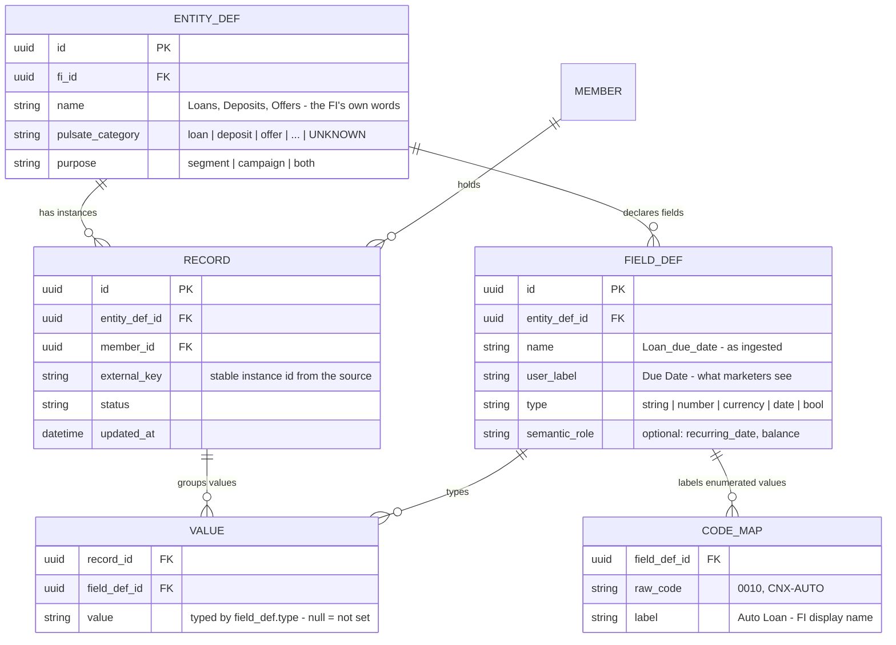
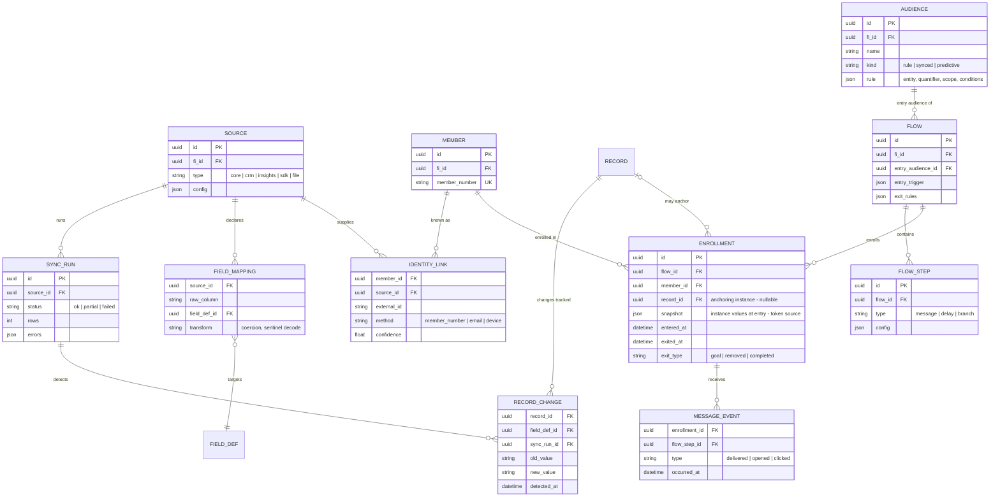

# Per-FI relational data model

**One universal mechanism: ingest any relational entity an FI sends — loans, deposits,
offers, insurance, anything — through four tables plus one label dictionary.** Nothing about
the domain is schema; entities, fields, and vocabularies are all rows. The only Pulsate
opinion is a category tag and a type on each field, which is what makes audiences, segments,
and personalization work on top.

## The kernel

Worked example — a Romanian FI's consumer-credit lineup, zero schema changes:

| Table | Rows |
|---|---|
| `ENTITY_DEF` | `(1, "Loans", loan, segment/campaign)` |
| `FIELD_DEF` | `(1, Loan_name, "Name", string)` · `(2, Loan_due_date, "Due Date", date)` · `(3, Loan_balance, "Balance", currency)` |
| `RECORD` | `(r1, entity 1, member 7, key L-0001)` — the Flexi Credit loan · `(r2, entity 1, member 7, key L-0002)` — the Emag installment plan |
| `VALUE` | `(r1, f1, "Flexi Credit")` `(r1, f2, 2026-09-01)` `(r1, f3, 4200)` · `(r2, f1, "Emag")` `(r2, f2, 2026-08-20)` `(r2, f3, 1150)` |

Why each piece exists — all four are load-bearing:

- **`RECORD` is the one thing a minimal entity→field→value sketch cannot skip.** It ties
  "Flexi Credit" and *its* due date and *its* balance together, so "any loan where due date is
  in the next 7 days **and** balance > 0" evaluates per loan — and a member with two
  qualifying loans enrolls twice. Values keyed by field alone cannot express same-instance
  matching.
- **`member_id`** connects instances to people; without it values float unattached and no
  audience can be built.
- **Typed values (not BLOBs)** are what make date windows, numeric comparisons, and
  is-not-set checks possible; `type` lives on the field definition, values must honor it, and
  null after sentinel decoding (`--/--/----` → null) means genuinely not-set.
- **`external_key`** keeps an instance stable across syncs (the core's account + share/loan
  ID — never column position); **`updated_at`** plus change capture below turn state
  snapshots into date anchors and derived signals.
- **`pulsate_category = UNKNOWN`** and unlabeled `CODE_MAP` rows are the "needs mapping"
  tasks; mapping them is the only modeling a customer ever does.

Everything the prototype demos is rows of this kernel: products are records of "Loans" /
"Deposits"; offers are records of "Offers" (amount, rate, expiration as field defs);
eligibility, scores, and CRM-fed member attributes are entities like any other (member
attributes as a one-record-per-member entity). The audience builder's entity picker
enumerates `ENTITY_DEF` rows.

## The operational shell

Plumbing around the kernel — how data gets in, how identities join, how changes become
signals, and how activation consumes records. Domain-agnostic by construction.

| Table | Purpose |
|---|---|
| `SOURCE` / `SYNC_RUN` | Where data comes from; per-run health (rows, partial failures, row-level errors). |
| `FIELD_MAPPING` | Source column → `FIELD_DEF`, with transforms (type coercion, sentinel decoding). Wizard output; shipped with the spec for standard extracts. |
| `MEMBER` / `IDENTITY_LINK` | The person, keyed by the core's member number; each source's external id with match method + confidence. |
| `RECORD_CHANGE` | Diff between syncs on kernel records — the mechanism that turns snapshots into date anchors, drift signals, and sync-derived goals. Pulsate never sees domain events (e.g. payments); it sees fields change. |
| `AUDIENCE` | Reusable; the rule JSON references an `ENTITY_DEF` + quantifier + same-record conditions. |
| `FLOW` / `FLOW_STEP` | Journey, entry trigger, explicit exit rules + re-enrollment policy. |
| `ENROLLMENT` | One membership of one member in one flow, optionally anchored to a kernel `RECORD`, with a value snapshot at entry — the unit of per-instance enrollment, instance-scoped exits, and personalization tokens. |
| `MESSAGE_EVENT` | Delivered / opened / clicked — the only engagement facts the platform claims. |

## Evidence

- One row per loan with stable Loan IDs, 46% multi-loan borrowers — real Symitar VIP extract
  (see `SYMITAR-FINDINGS.md`); the extract is already relational, the kernel just preserves it.
- 48% sentinel-encoded blanks (`--/--/----`) → typed values with real nulls.
- 94% stale due dates in the sample file → freshness and recurrence must be change-driven
  (`RECORD_CHANGE`), not assumed.
- 19 per-FI numeric product codes → `CODE_MAP` is the only customer-facing modeling task.
- Offers with amounts/rates/expirations (CuneXus-style prequalification) ingest as an entity
  with three field defs — no schema work.
