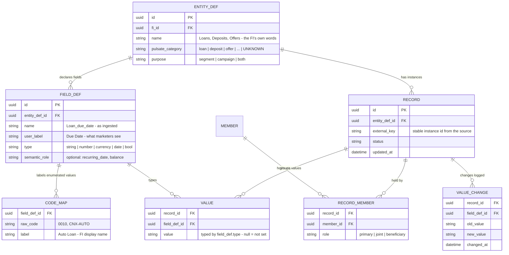

# Per-FI relational ingestion model

Six small tables plus one label dictionary. Any relational entity an FI sends — products,
offers, eligibility, or any other member-related metadata — ingests as **rows**, never schema.
Every table is scoped to the FI (`fi_id`) and every instance is related to one or more members
(joint ownership is first-class). This is the complete model needed to build segments on that
data and personalize campaigns from it.

## Worked example

Any FI, any vocabulary — here a consumer-credit lineup — with zero schema changes:

| Table | Rows |
|---|---|
| `ENTITY_DEF` | `(1, "Loans", loan, segment/campaign)` |
| `FIELD_DEF` | `(1, Loan_name, "Name", string)` · `(2, Loan_due_date, "Due Date", date)` · `(3, Loan_balance, "Balance", currency)` |
| `RECORD` | `(r1, entity 1, key L-0001)` — the Flexi Credit loan · `(r2, entity 1, key L-0002)` — the Emag installment plan |
| `RECORD_MEMBER` | `(r1, member 7, primary)` · `(r1, member 12, joint)` · `(r2, member 7, primary)` |
| `VALUE` | `(r1, f1, "Flexi Credit")` `(r1, f2, 2026-09-01)` `(r1, f3, 4200)` · `(r2, f1, "Emag")` `(r2, f2, 2026-08-20)` `(r2, f3, 1150)` |

Offers are just another `ENTITY_DEF` (fields: amount, rate, expiration); so are eligibility
facts, scores, and any other metadata. Member-level attributes (e.g. CRM fields) are an entity
with one record per member.

## Why each piece is load-bearing

- **`RECORD`** — the one thing a minimal entity→field→value sketch cannot skip. It ties
  "Flexi Credit" and *its* due date and *its* balance together, so "any loan where due date is
  in the next 7 days **and** balance > 0" evaluates per loan, and a member with two qualifying
  loans is targetable per loan. Values keyed by field alone cannot express this.
- **`RECORD_MEMBER`** — relates every instance to its people, with a role. One loan can have a
  primary and a joint holder (the real Symitar extract had 279 joint NAME records); a plain
  `member_id` column on `RECORD` would either drop the joint holder or duplicate the record.
  Segments target the member; `role` lets a rule say "primary holders only" when it matters.
- **`VALUE_CHANGE`** — an append-only log written whenever a sync changes a `VALUE`. This is
  the decision, not a maybe: without it, "due date advanced" (the sync-derived goal), drift
  detection, and re-entry on a date anchor are unanswerable, because nightly full snapshots
  overwrite the evidence. At batch cadence it is cheap — only changed values produce rows.
- **Typed values, not BLOBs** — `type` on `FIELD_DEF` is what makes date windows, numeric
  comparisons, and is-not-set checks possible; null means genuinely not-set (sentinels like
  `--/--/----` decoded on ingest).
- **`external_key`** — the source's stable instance id (e.g. account + loan ID), so a record
  stays the same record across syncs; never identify by file column position.
- **`pulsate_category = UNKNOWN`** and unlabeled `CODE_MAP` rows — the "needs mapping" queue;
  mapping them is the only modeling a customer ever does.

## How segments and personalization read it

| Use | Query shape |
|---|---|
| Segment on products ("any loan where Due Date in next 7 days and Balance > 0") | members related (via `RECORD_MEMBER`) to ≥1 `RECORD` of the entity whose `VALUE`s satisfy all conditions **on the same record**; quantifiers (any / none / 2+) count matching records per member |
| Segment on offers / eligibility / other metadata | identical — only the `ENTITY_DEF` differs |
| Cross-entity ("eligible for X, holds no X") | intersect per-member results across two entity defs |
| Personalized campaign (`{{loan.due_date}}`, `{{offer.amount}}`) | the record that qualified the member supplies its `VALUE`s as tokens — per-record targeting means "your Emag installment is due Aug 20", not a guess between loans |
| Change-driven ("due date advanced", drift, re-entry on a recurring date) | `VALUE_CHANGE` rows for that field since the last evaluation — the only place a batch-overwritten snapshot leaves evidence |

## Physical note

This is the logical model, not the storage plan. At query time the EAV shape is served from
typed projections (a materialized wide table per `ENTITY_DEF`, rebuilt on sync), so segment
evaluation runs on real columns — the ERD above is the ingestion contract, not the index the
rule engine scans.

## Scopes and segments are views

Nothing the segment builder shows is stored — it is all queries over the kernel:

- A **scope** is `(entity, code category)`, resolved live through `CODE_MAP.category` on the
  entity's code field. Re-categorizing a code moves its records between scopes instantly, the
  same way relabeling changes display names. Constraint this relies on: **exactly one field
  per entity carries the `code` role** — the binding step designates the primary classifier;
  any second classifier is an ordinary string field.
- A **segment** is an AND of blocks; each block is a quantifier (any / none / 2+) over one
  scope with conditions that must match the same record. Membership = the intersection of
  per-block member sets — the kernel answers each block independently. The first non-"none"
  block is **primary**: its matching records drive per-record enrollment and supply
  personalization values; "none" blocks are person-level filters.
- Known limit, chartable evolution: blocks are entity-bound because conditions bind to one
  entity's field names. When two sources contribute entities in the same category, a unified
  category scope needs conditions expressed in **semantic roles** (each entity's balance-role
  field) rather than field names — the role layer is the designated path. Production rules
  should also reference `entity_def_id` / `field_def_id`, not display names.

## Working implementation

This model runs in the prototype against a real Symitar VIP extract: `db/schema.sql` is the
kernel as SQLite DDL, `tools/ingest-symitar.mjs` ingests the raw `VIP.LOAN` + `VIP.NAME` files
(`npm run ingest <VIP.LOAN> <VIP.NAME>` — idempotent; re-runs write only `VALUE_CHANGE` rows),
and `tools/dbApi.mjs` serves the app from the DB in dev. `RECORD_MEMBER` is populated from real
NAME records — account-level joint owners hold every loan, loan-scoped names (Name Location
`L####`) hold only theirs. No PII reaches the DB: member identity is a salted hash, and names,
SSNs, contact data, and raw account numbers never leave the source files.
