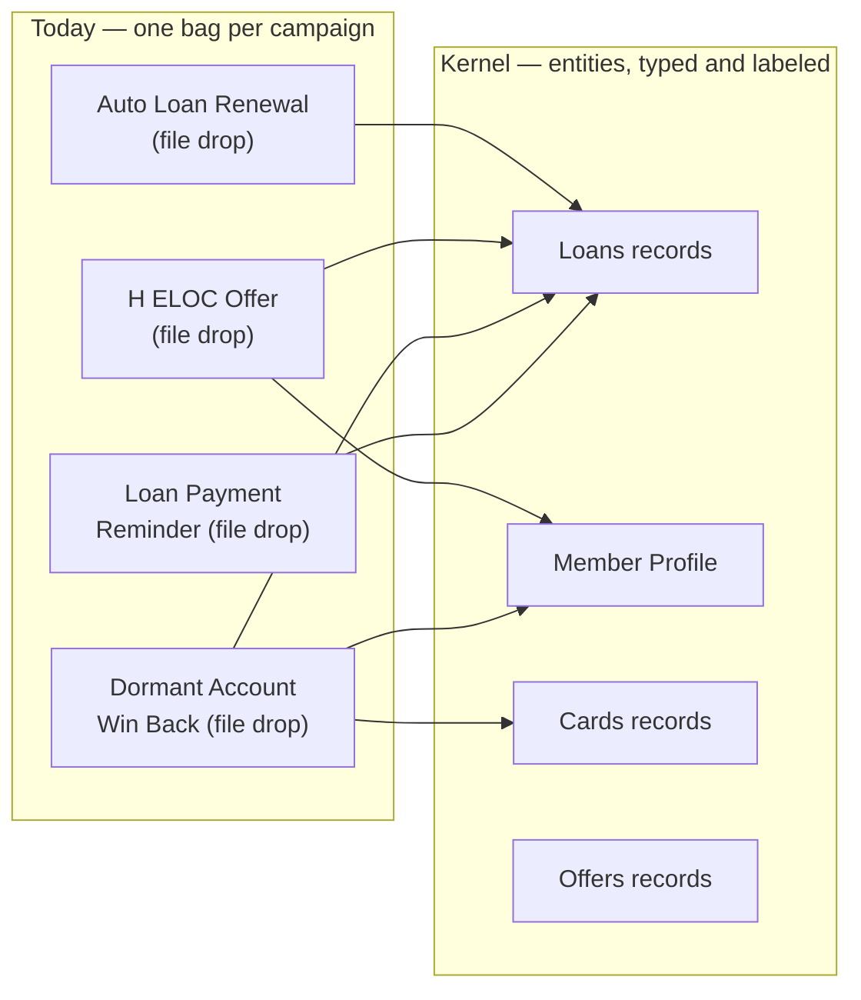

# Segment builder migration brief

**From campaign-shaped attribute bags to the entity kernel — without breaking a single
saved segment.** Companion to the [data model](https://claude.ai/code/artifact/da4dfc78-e393-43cf-842e-858f28ff3e73);
the prototype's *Data → Migration preview* tab renders the mapping table below live.

## 1 · Production reality (observed, staging, Aug 2026)

The production segment builder already does the things horizontal competitors are praised
for: mixed AND/OR row composition, behavioral event conditions (`Last In App Event`,
occurrence counts), device/location/activity sources, attribute search. The composition
layer is fine. Everything wrong with it traces to the data underneath:

| Pathology | Evidence on screen | Root cause |
|---|---|---|
| Untyped operators | `HELOC Offer->Member_Age is less than __ minutes ago` — an age compared as a timestamp | No field types; one operator set for everything |
| Relative-time only | `Join_Date is equal to __ years ago` — no calendar dates, no between, no is-set | Same — this is the customer gap analysis (G-1…G-8) verbatim |
| Raw vocabulary | `Direct_Deposit_Status`, `Entity->Attr` arrow notation | No label layer between source columns and marketers |
| Mangled names | "H ELOC Offer", "C D Offer CD Renewal" | Auto-splitting of source names, no curated naming |
| Entity-per-campaign | "Dormant Account Win Back", "Loan Payment Reminder", "Birthday Anniversary" as permanent condition sources | Each campaign's CSV becomes a new attribute bag; the menu grows forever |
| One record per member | No way to say *the same loan* is past due AND above $500 | Flat bags can't hold instances |
| Estimate on demand | "Estimate segment" button | Counting is expensive against the bag layout |

## 2 · Diagnosis: substrate, not builder

The fix is **not** a builder redesign. Production's flat rows with per-row And/Or
connectors map 1:1 onto the kernel's blocks-and-joins model (the prototype reproduces the
interaction exactly, plus live reach). Every pathology above is a property of the storage:
per-campaign attribute bags with untyped values and no naming layer. Swap the substrate,
keep the muscle memory.

## 3 · The kernel mapping

Target model (see the data-model doc for the full ERD): `ENTITY_DEF → FIELD_DEF →
RECORD → VALUE` + `CODE_MAP` labels + `RECORD_MEMBER` roles + `VALUE_CHANGE` history.
A legacy attribute bag is the degenerate case: **one entity, one record per member** — so
migration is mechanical, and multi-instance data (real loans, real cards) becomes possible
without another migration later.

Every condition source in today's builder, mapped:

| Legacy source | Becomes | Category | Disposition |
|---|---|---|---|
| All Users | the baseline audience | — | platform |
| Personal | **Member Profile** (Alias, Email, Age·number) | member | migrate |
| Activity | SDK stream | behavior | platform |
| Events | **App Events** reserved entity | behavior | platform |
| Cunexus | **CuNexus Offers** — one record per offer | offer | migrate |
| Device Settings | SDK-owned | member | platform |
| Location Events | SDK stream | behavior | platform |
| Auto Loan | folds into **Loans** records (auto-typed code) | loan | migrate |
| Auto Loan Renewal | archive — data = Loans · Maturity Date | loan | campaign artifact |
| Credit Card Activation Usage | **Cards** — typed activation/usage fields | card | migrate |
| H ELOC Offer | archive — Member_Age→Member Profile, Loan_Type/Balance→Loans | offer | campaign artifact |
| Personal Loan Promotion | archive — data = Loans + offer records | offer | campaign artifact |
| C D Offer CD Renewal | **Certificates** (name un-mangled; calendar date ops) | certificate | migrate |
| Debit Card Activation Usage | **Debit Cards** (Activation_Date · date) | card | migrate |
| E Statement Enrollment | bool field on **Member Profile** (false ≠ never-set) | member | migrate |
| Direct Deposit | **Direct Deposits** (Status·bool, Amount·currency, Frequency·code; Employment_Status→Member Profile) | deposit | migrate |
| Loan Payment Reminder | archive — is exactly the Due Date playbook (recurring_date role) | loan | campaign artifact |
| Birthday Anniversary | archive — birthday = recurring_date on Member Profile | member | campaign artifact |
| Dormant Account Win Back | archive — four columns, four homes (Accounts, Cards, Member Profile) | deposit | campaign artifact |
| Custom Data | dissolved — every entity IS custom data, typed and labeled | — | platform |

**Tally: 8 become real entities · 7 are campaign artifacts to archive (their data
re-homed) · 5 are platform machinery.** The condition menu shrinks from 20 flat items to a
categorized data dictionary that stops growing per campaign.

## 4 · Segment translation rules (zero-breakage)

A legacy segment is a flat list of rows: `(source, attribute, operator, value, unit)`
joined by per-row And/Or. That is a strict subset of the kernel's blocks+joins:

- **Row → block.** Each legacy row becomes a one-condition block on the mapped entity
  (`quantifier: any`; the bag was one-record-per-member, so any ≡ the old semantics).
- **And/Or → joins, verbatim.** Production's connector-per-row model is exactly `joins[i]`.
- **Operator translation** (the only part needing review):

| Legacy operator | On a date field | On a number field |
|---|---|---|
| `less than N <unit> ago` | `next_n`/`past_n` window (exact) | ⚠ human review — the unit was meaningless; usually intent is `lt N` |
| `more than N <unit> ago` | `past_n` (exact) | ⚠ human review |
| `equal to N years ago` | `between_dates` calendar window (that year) | ⚠ human review |
| `is true / false` | — | bool; note **false ≠ never-set** — legacy conflated them, kernel distinguishes; default translation preserves legacy behavior (false OR not-set) with a review flag |
| `Number Of Event Occurrences = N` | needs the parametric count quantifier (Phase 3); until then any/none/2+ cover N∈{≥1, 0, ≥2} | — |

Translation is therefore **total minus an enumerable review set**: the mis-typed operator
rows (a query over saved segments finds every one) and bool not-set conflations. Everything
else migrates mechanically; old and new engines can run side by side on the same segments
during cutover, diffing membership before flipping.

## 5 · Phased rollout

| Phase | What ships | What it unlocks | Lift |
|---|---|---|---|
| **P1 — Typed operators** | `FIELD_DEF.type` on existing attributes; operator menus keyed by type | Closes the customer gap analysis (calendar dates, between, is-set); kills age-in-minutes-ago; **no data migration** | Small |
| **P2 — Kernel underneath** | Bags → single-record entities; labels + categories; dictionary UI; segment auto-translation | Menu becomes a curated dictionary; names fixed; campaign artifacts archived; live reach becomes feasible (typed projections) | Medium |
| **P3 — Multi-instance** | Real Loans/Cards/Offers records; same-record conditions; per-record enrollment + tokens; `RECORD_MEMBER` roles; count quantifiers | "The same loan is past due AND > $500"; one reminder per qualifying loan; `{{loans.due_date}}` per record; joint-holder targeting & primary-only sends | Large — the differentiator |
| **P4 — Unification** | Events as a reserved entity in the same builder; household (derived from shared records); role-based cross-entity scopes | One mental model for products, offers, eligibility AND behavior; household suppression/KPIs | Medium |

## 6 · Risks & open questions

- **Identity**: member vs device vs hashed account key — the canonical id must be settled
  before P2 (the kernel stores identity as a salted hash today).
- **In-flight campaigns** pin legacy segment ids — translation must preserve ids, not
  recreate segments.
- **Consent & addressability**: role-linked people (co-borrowers) exist in the data but
  have no channel consent — P3 targeting must gate on reachability.
- **Rule references**: production rules must reference `entity_def_id`/`field_def_id`,
  never display names (renames break name-referenced rules).
- **Silently stale bags**: one-record-per-member data has no freshness contract; the
  kernel's `VALUE_CHANGE` + per-source cadence makes staleness visible — expect to
  discover stale bags during P2 and decide archive-vs-refresh per source.

## 7 · Where to look

- Data model + working implementation: the [DATA-MODEL artifact](https://claude.ai/code/artifact/da4dfc78-e393-43cf-842e-858f28ff3e73)
  (kernel ERD, scopes/segments-as-views, SQLite pipeline against a real Symitar VIP extract).
- The prototype (branch `relational_entities_support`) demonstrates the P2/P3 end state:
  live reach, blocks + AND/OR joins, category scopes, typed conditions, per-record
  enrollment semantics, the migration preview, and honest empty states for everything
  without data.
